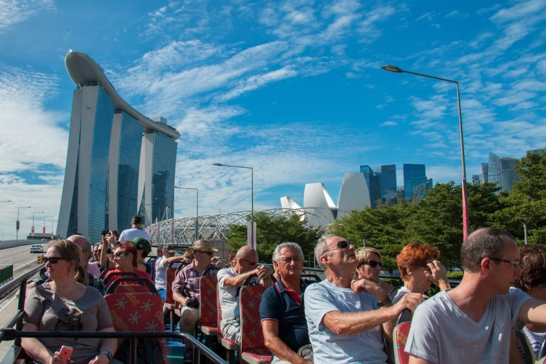
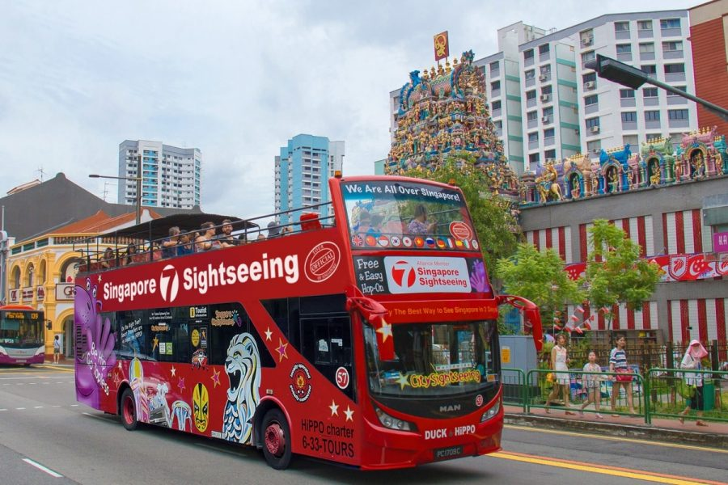
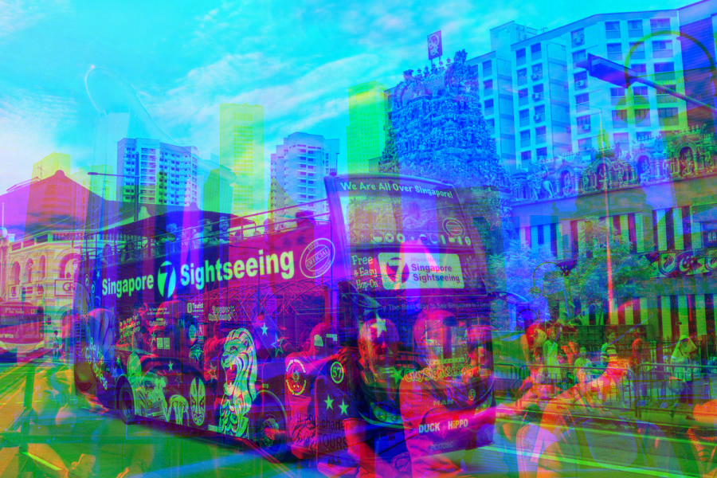

<h1>Image Steganography</h1>

    

        "Steganography [...] is the practice of concealing a file, message, image, or video within another file, message, image, or video."
        <a href="https://en.wikipedia.org/wiki/Steganography">Wikipedia</a>
    

    

        In this project I explore different algorithms for image steganography. The goal is to understand different types of approaches, their pros and cons and their applicative scenarios.
    

    

        <ul>
        <li> Code Image: Image to hide </li>
        <li>Cover Image: Image used to hide the code image</li>
        <li>Stego Image: Cover image with the code image embedded</li>
        </ul>
    

<h2>Weighted RGB Merge</h2>

We can create a stego image from 3 images, by using one channel from each image. In this case each of the 3 images acts as cover image and code image at
the same time.

 

    This method is obviously not very smart if your goal is to hide an image within another image. You might even be able to discern the different images visually.
    Another downside is that we can only recover one channel from each image, essentially losing the color color information.
    You can somewhat make it not as obvious by adding weights to each channel of the stego image.

