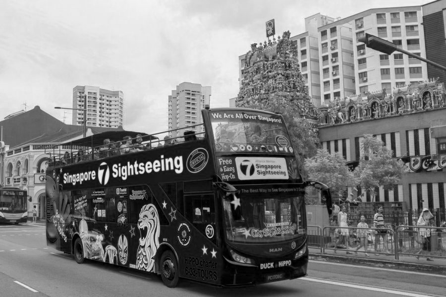

<h1>Image Steganography</h1>

    

        "Steganography [...] is the practice of concealing a file, message, image, or video within another file, message, image, or video."
        <a href="https://en.wikipedia.org/wiki/Steganography">Wikipedia</a>
    

<h2>RGB Merge</h2>

We can create a stego image from 3 images, by using one channel from each image. In this case each of the 3 images acts as cover image and code image at
the same time.

Cover Images/Code Images:  
  

Stego Image:  
  

Reconstruction:  
  

    We have merged 3 images into 1 image, but since we only take one channel per image we lose color-information, as the reconstruction shows.
    To solve this problem, we can use the <a href="https://en.wikipedia.org/wiki/Bayer_filter">Bayer pattern (BG)</a>. Instead of storing one whole channel of an image,
    we store multiple channel of an image at specific location, giving us the following grid:  
     
    When we reconstruct an image, we just have to interpolate the missing colors.  

    Stego Image:  
      

    Reconstruction:  
      

     This method can restore the color but note that we had to interpolate some missing colors, meaning all restored images will have worse quality than before.

